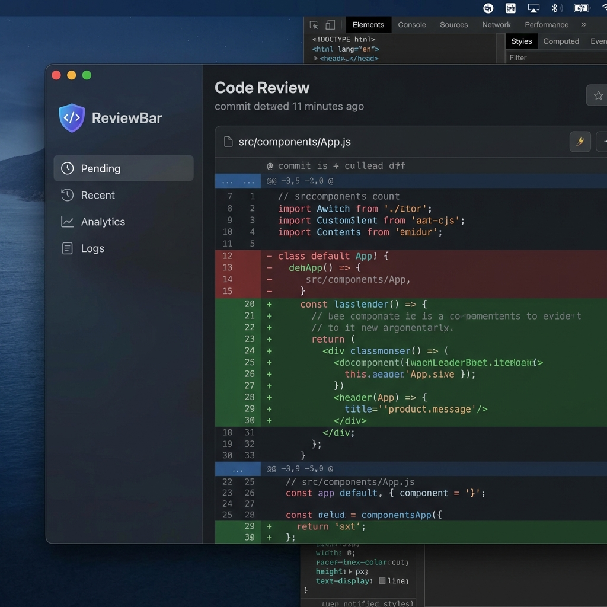

<div align="center">

# ReviewBar

**AI-Powered Code Reviews in Your Menu Bar**

[](https://swift.org)
[](https://www.apple.com/macos)
[](LICENSE)



</div>

---

## ✨ Features

- **🧠 AI-Powered Analysis** — Get intelligent code reviews using Claude, Gemini, OpenAI, or your local CLI tools
- **⚡ Menu Bar Native** — Lives in your macOS menu bar, always one click away
- **🔒 Privacy-First** — Use CLI tools (no API keys), or bring your own keys
- **🔔 Smart Notifications** — Get notified when PRs need your attention
- **📊 Analytics** — Track your review patterns and response times
- **🎨 Modern UI** — Glassmorphism design with dark mode support

## 🚀 Quick Start

### Requirements

- macOS 14.0 (Sonoma) or later
- Xcode 15+ (for building from source)
- A GitHub Personal Access Token ([generate one](https://github.com/settings/tokens/new?scopes=repo,read:user))

### Installation

#### GitHub Releases
Download the latest `.dmg` from [Releases](https://github.com/zymawy/reviewBar/releases)

#### Homebrew (macOS)
```bash
brew install --cask zymawy/tap/reviewbar
```

#### CLI Only
```bash
brew install zymawy/tap/reviewbar
```

#### Build from Source
```bash
git clone https://github.com/zymawy/reviewBar.git
cd reviewBar
swift run ReviewBar
```

### First Launch

1. **GitHub Token** — Paste your PAT when prompted during onboarding
2. **Choose AI Provider** — Select from detected CLI tools or configure an API key
3. **Ready!** — Click the menu bar icon to see your pending reviews

## 🤖 AI Providers

ReviewBar supports multiple AI backends:

| Provider | Type | API Key Required |
|----------|------|------------------|
| Claude (API) | Cloud | ✅ Yes |
| OpenAI (API) | Cloud | ✅ Yes |
| Gemini (API) | Cloud | ✅ Yes |
| **Claude Code (CLI)** | Local | ❌ No |
| **Gemini CLI** | Local | ❌ No |
| **GitHub Copilot** | Local | ❌ No |

> **Tip:** CLI providers run locally in a cloned repo context, giving the AI full codebase awareness.

## 🛠️ Configuration

### Settings

Access settings via **Menu Bar Icon → Settings** or `⌘,`

| Category | Options |
|----------|---------|
| **General** | Launch at login, polling interval, dock visibility |
| **Providers** | GitHub token, watched repositories |
| **AI** | Provider selection, model, API keys |
| **Notifications** | Review completion alerts, Slack integration |

### CLI Tool Detection

ReviewBar automatically detects CLI tools installed at:
- `/opt/homebrew/bin/`
- `/usr/local/bin/`
- `~/.local/bin/`

## 📁 Project Structure

```
ReviewBar/
├── Sources/
│   ├── ReviewBar/           # Main app target
│   │   ├── Views/           # SwiftUI views
│   │   ├── AppDelegate.swift
│   │   └── ReviewStore.swift
│   ├── ReviewBarCore/       # Core library
│   │   ├── Agents/          # LLM providers
│   │   ├── Models/          # Data models
│   │   ├── Providers/       # GitHub integration
│   │   └── Services/        # Clone manager, etc.
│   └── ReviewBarCLI/        # Command-line interface
├── Tests/
├── Package.swift
└── README.md
```

## 🤝 Contributing

We welcome contributions! Please see [CONTRIBUTING.md](CONTRIBUTING.md) for guidelines.

### Development Setup

```bash
# Clone
git clone https://github.com/zymawy/reviewBar.git
cd reviewBar

# Open in Xcode (optional)
open Package.swift

# Run tests
swift test

# Build release
swift build -c release
```

### Code Style

- Follow [Swift API Design Guidelines](https://swift.org/documentation/api-design-guidelines/)
- Use SwiftLint (configuration included)
- Write tests for new features

## 📄 License

This project is licensed under the **MIT License** — see [LICENSE](LICENSE) for details.

## 🙏 Acknowledgments

- [SF Symbols](https://developer.apple.com/sf-symbols/) — Apple's icon library
- [SwiftUI](https://developer.apple.com/xcode/swiftui/) — Modern declarative UI framework
- The open-source community for inspiration

---

<div align="center">

**Made with ❤️ for developers who value fast, intelligent code reviews.**

[Report Bug](https://github.com/zymawy/reviewBar/issues) · [Request Feature](https://github.com/zymawy/reviewBar/issues)

</div>
